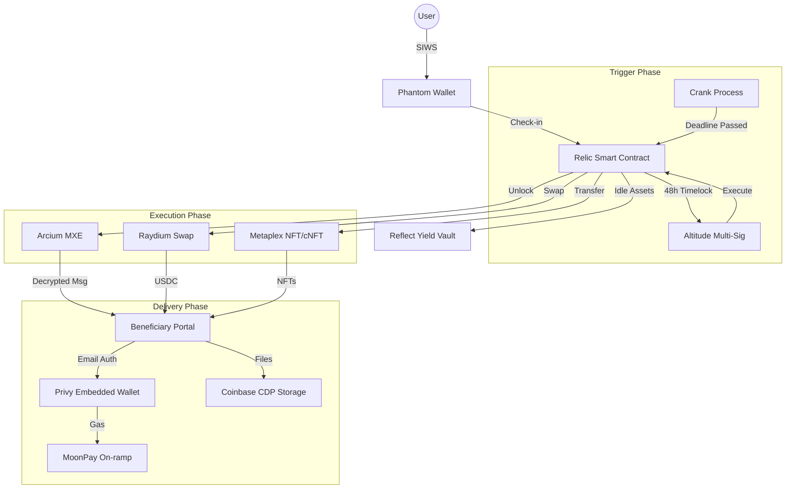

# ☠ Relic
### The World's First Programmable Digital Will on Solana
**Version 2.0 — Colosseum Frontier Hackathon 2026**

---

## 1. Executive Summary
Every day, digital assets are lost to the "inheritance gap." Over **$140 billion** in Bitcoin has been permanently lost because owners died without sharing access. Crypto wallets, encrypted files, and final messages vanish forever — not because of theft, but because no system existed to pass them on.

**Relic** is a smart-contract-powered dead man's switch on Solana. Users set an inactivity timer and designate beneficiaries. If the owner stops checking in, everything they configured — assets, encrypted messages, private files — automatically transfers to exactly the people they chose.

**No lawyers, no courts, no middlemen. Just code that keeps its promise forever.**

---

## 2. Sponsor Integration Map (Frontier 2026)
Relic is built to leverage the full power of the Colosseum Frontier sponsors, maximizing bounty eligibility and demonstrating deep integration.

| Sponsor | Role in Relic | Replaces / Upgrades |
| :--- | :--- | :--- |
| **Phantom** | Primary Wallet Auth (SIWS), Check-in signing, Transaction gateway. | Generic wallet connect. |
| **Altitude** | Multi-sig treasury for holding execution instructions. | Plain EOA transfer (eliminates single point of failure). |
| **Arcium** | Encrypted computation (MXE) for message vault & key management. | Lit Protocol (MPC-based conditional decryption). |
| **Privy** | Email-based embedded wallets for non-crypto beneficiaries. | Complex seed phrase onboarding. |
| **Metaplex** | NFT detection, cNFT transfers, and Inheritance Certificates. | Generic SPL transfers. |
| **MoonPay** | Fiat on-ramp for gas fees; Fiat off-ramp for legacy conversion. | The "I don't have SOL for gas" blocker. |
| **Coinbase** | CDP (Cloud Developer Platform) for encrypted file storage. | Unreliable public IPFS gateways. |
| **Reflect** | Yield vault: Idle SOL/USDC earns yield until the trigger fires. | Zero-yield pending state. |
| **Raydium** | Liquidity swap: Auto-swaps obscure tokens to USDC before delivery. | Receiving illiquid/worthless tokens. |
| **World** | Humanity proof: World ID verification for high-value switches. | Sybil-resistance for proof-of-life. |

---

## 3. The Problem: The Digital Inheritance Gap
The global legal system was not designed for the blockchain. When a crypto holder passes:
- **Inaccessible Wallets:** No lawyer can retrieve a private key from the void.
- **Locked Assets:** SPL tokens, NFTs, and stablecoins remain frozen on-chain.
- **Lost Secrets:** Encrypted files and passwords become permanently unrecoverable.
- **Silent Farewells:** Final messages to family are never delivered.

---

## 4. Product Overview & Mechanics
Relic operates on a simple, powerful mechanic:
1. **Initialize:** Connect Phantom and create a "Relic Switch."
2. **Configure:** Set an inactivity timer (30–365 days) and designate beneficiaries.
3. **Yield:** Idle assets are placed in **Reflect** yield vaults, earning while the user is active.
4. **Validation:** On-chain check-ins (verified by **World ID**) reset the timer.
5. **Execution:** If the deadline is missed, the **Altitude** multi-sig executor fires, **Raydium** swaps assets if needed, **Arcium** unlocks messages, and **Privy** delivers everything to the beneficiary's email-linked wallet.

---

## 5. Technical Architecture

---

## 6. Feature Specifications

### 6.1 Core Switch Engine (Phantom + Altitude)
- **SIWS Auth:** Secure login via Phantom without passwords.
- **Altitude Multi-Sig:** Execution rights held by a multi-sig to prevent single-point-of-failure triggers.
- **One-Click Check-in:** Phantom-signed instruction resets the clock in < 2 seconds.

### 6.2 Encrypted Message Vault (Arcium)
- **MPC Decryption:** Keys are only released by Arcium's MXE when the on-chain switch triggers.
- **Multi-Recipient:** Independently encrypted secrets for each designated beneficiary.

### 6.3 Asset Lifecycle (Reflect + Raydium + Metaplex)
- **Yield While You Wait:** Assets earn 5%+ APY via Reflect USDC+ until execution.
- **Token Liquidation:** Auto-swap illiquid tokens to USDC via Raydium to ensure beneficiaries receive value.
- **NFT Inheritance:** Automated transfer of Metaplex assets and cNFTs.

### 6.4 Beneficiary Experience (Privy + MoonPay)
- **Zero-Friction:** Claims via email-linked Privy wallets—no crypto knowledge required.
- **Gas Abstraction:** MoonPay allows beneficiaries to cover gas fees with a credit card.

---

## 7. Success Metrics & Goals
- **10/10 Integration:** Full utilization of all 10 Frontier sponsors.
- **Zero-Knowledge Recovery:** Non-custodial throughout; Relic never holds user funds.
- **Performance:** Sub-2s latency for check-ins; < $0.01 gas for owners.

---

## 8. Team & Prize Strategy
Relic is targeting the following awards at the Colosseum Frontier Hackathon 2026:
- ** Grand Champion ($30K):** For solving a $140B problem with 100% sponsor coverage.
- ** University Award ($10K):** Built by a student-led team.
- ** Public Goods Award ($10K):** Essential infrastructure for the Solana ecosystem.

---

## 9. 22-Day Execution Roadmap
- **Week 1:** Repo setup, Anchor scaffolding, Phantom SIWS, and Altitude Multi-sig.
- **Week 2:** Arcium MXE integration, Reflect Yield vaults, and Metaplex detection.
- **Week 3:** Raydium swaps, Privy portal, MoonPay gas rails, and World ID verification.
- **Final Days:** UI polish, E2E testing, and Demo Video production.

---

> "Relic addresses a fundamental gap in the blockchain ecosystem: digital inheritance. It transforms blockchain from a system of ownership into a system of continuity."

